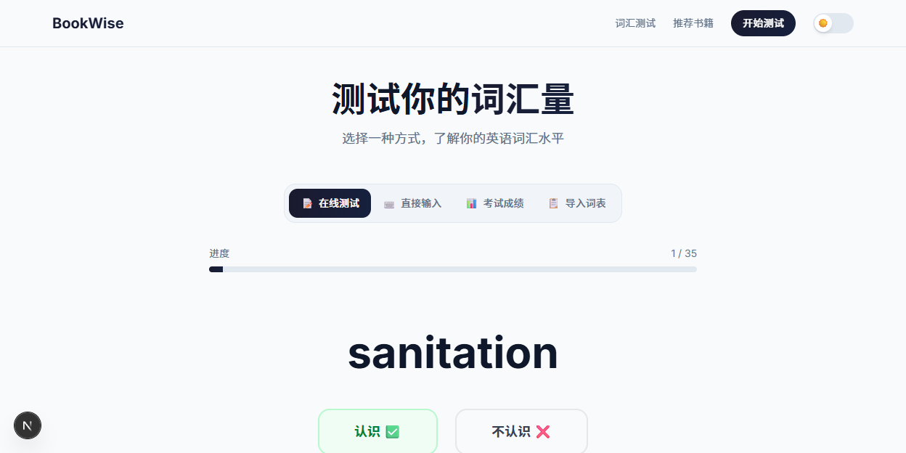

# BookWise 📚

> 根据英语词汇量 AI 推荐 80% 词汇覆盖率的英文书籍

BookWise 帮助中国英语学习者找到适合自己词汇水平的全英文书籍。通过自适应词汇测试推算你的词汇量，然后自动筛选出词汇覆盖率 ≥80% 的书籍，让英文阅读不再是痛苦的查词过程。

## 📸 预览





## ✨ 核心功能

- **🧠 自适应词汇测试** — 基于 COCA 词频表的贝叶斯推算，30 词精准评估词汇量
- **📊 多种输入方式** — 支持在线测试、直接输入、考试成绩映射（四六级/考研/托福/雅思）、导入单词表
- **📈 智能覆盖率计算** — 按词频分布精确计算每本书的词汇覆盖率
- **📚 个性化推荐** — 80 本经典英文书，按覆盖率排序，支持难度/分类筛选
- **📖 书籍详情** — 每本书都有封面图片、中文简介、覆盖率分析和阅读建议
- **🌙 深色模式** — 支持浅色/深色主题切换，自动保存偏好

## 🛠️ 技术栈

| 类别 | 技术 |
|------|------|
| 框架 | Next.js 16 + React 19 + TypeScript |
| 样式 | Tailwind CSS v4 + Framer Motion |
| 数据 | COCA 词频表 (2000词) + Open Library 封面 |
| 算法 | 自适应贝叶斯词汇量推算 + 词频覆盖率计算 |
| 部署 | Vercel Serverless |

## 🚀 快速开始

```bash
# 克隆仓库
git clone https://github.com/yixiaobai57/bookwise.git
cd bookwise

# 安装依赖
npm install

# 启动开发服务器
npm run dev
```

打开 http://localhost:3000 即可预览。

## 📁 项目结构

```
bookwise/
├── app/
│   ├── page.tsx              # 首页（Hero + 功能介绍）
│   ├── test/page.tsx         # 词汇测试页（4种输入方式）
│   ├── recommend/page.tsx    # 推荐列表页（筛选 + 卡片网格）
│   ├── book/[id]/page.tsx    # 书籍详情页（封面 + 简介 + 覆盖率）
│   └── api/                  # Serverless API 路由
├── components/               # React 组件
│   ├── Navbar.tsx            # 顶部导航（含深色模式切换）
│   ├── BookCard.tsx          # 书籍卡片（封面 + 覆盖率圆环）
│   ├── VocabularyTest.tsx    # 自适应词汇测试组件
│   ├── CoverageCircle.tsx    # 覆盖率圆形进度条
│   └── FilterBar.tsx         # 筛选标签栏
├── lib/                      # 核心算法库
│   ├── vocabulary.ts         # 贝叶斯词汇量推算
│   ├── coverage.ts           # 覆盖率计算引擎
│   ├── recommend.ts          # 推荐算法
│   └── ai-analyze.ts         # AI 语义分析
├── data/                     # 数据文件
│   ├── books.json            # 80 本精选书库（含封面URL和简介）
│   ├── coca-frequency.json   # COCA 词频表（前2000词）
│   └── exam-mapping.json     # 考试成绩→词汇量映射
└── public/                   # 静态资源
```

## 🌐 部署到 Vercel

1. 推送代码到 GitHub
2. 访问 [vercel.com](https://vercel.com)
3. 点击 **"Add New" → "Project"**
4. 导入 `bookwise` 仓库
5. 点击 **"Deploy"** 即可

## 📖 书籍库

80 本精选英文书，涵盖：

| 分类 | 示例书籍 |
|------|----------|
| 小说 | 傲慢与偏见、简·爱、了不起的盖茨比 |
| 科幻 | 1984、沙丘、饥饿游戏 |
| 历史 | 双城记、罗马帝国衰亡史 |
| 哲学 | 理想国、沉思录、君主论 |
| 科普 | 物种起源、时间简史、寂静的春天 |
| 传记 | 本杰明·富兰克林自传、海伦·凯勒自传 |

难度分级：四级 / 六级 / 考研 / 托福 / 雅思

## 📄 许可证

MIT License
